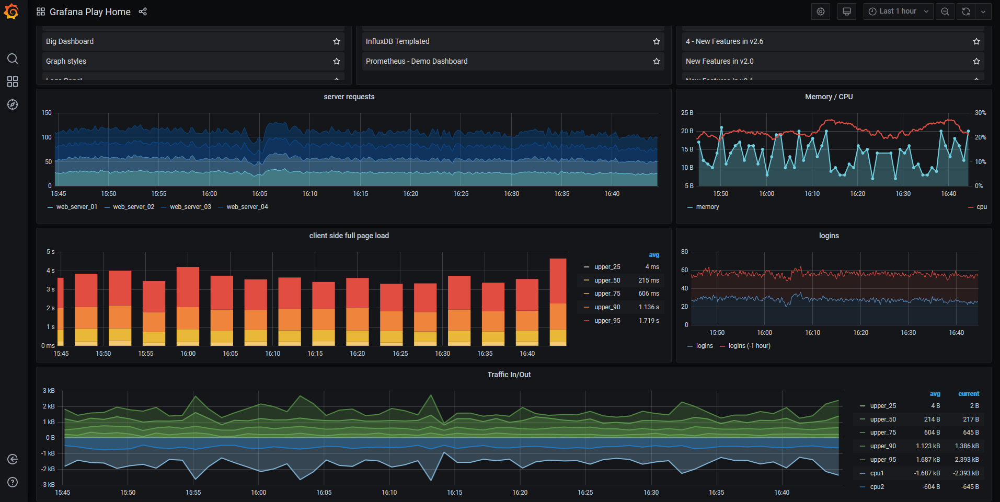
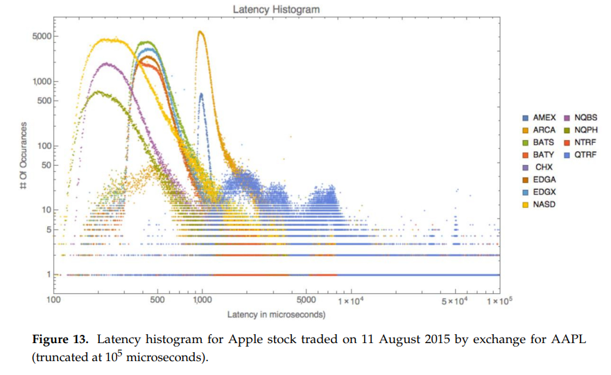
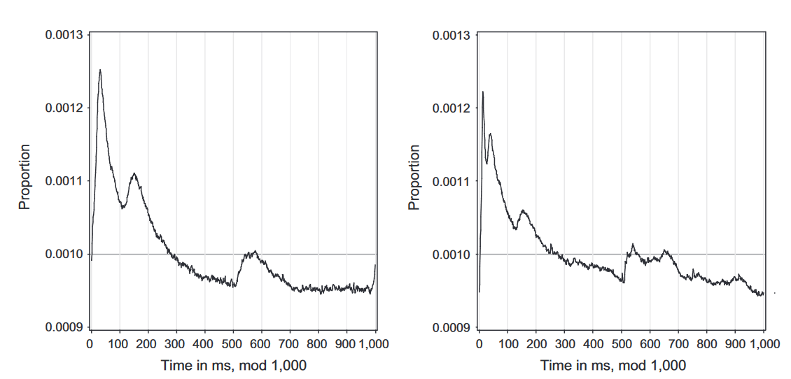
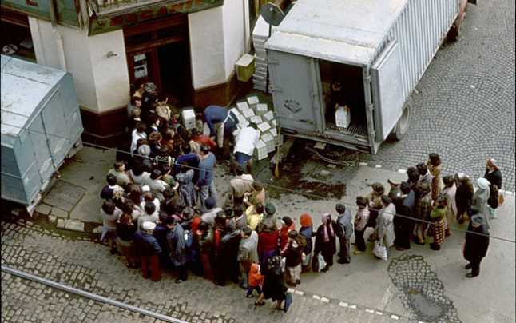
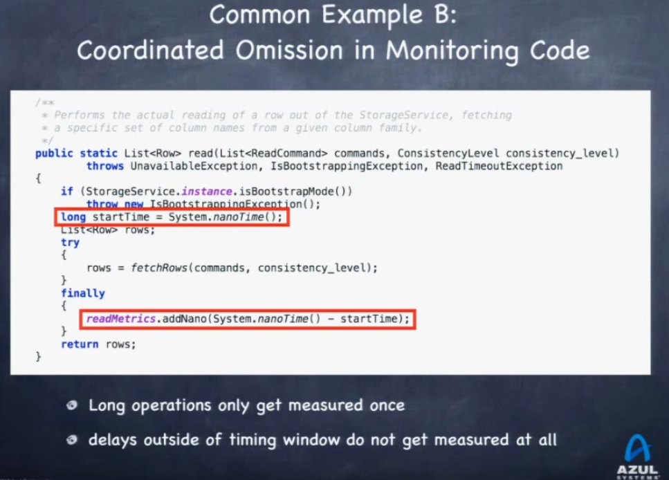
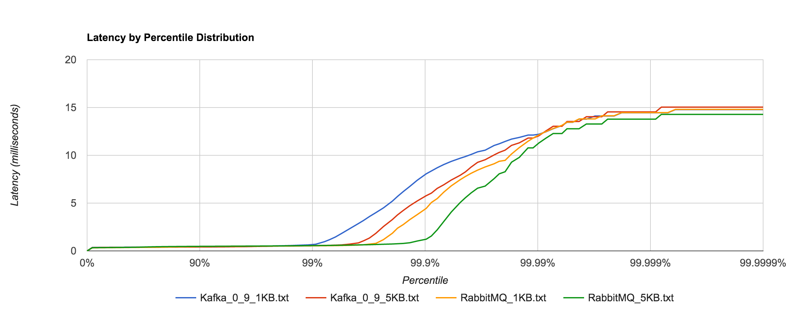
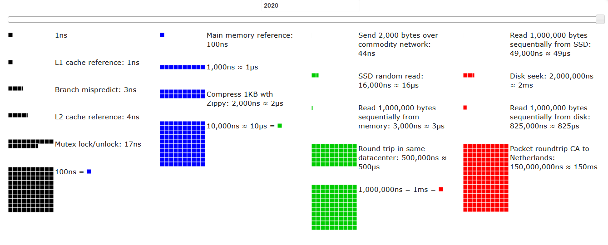
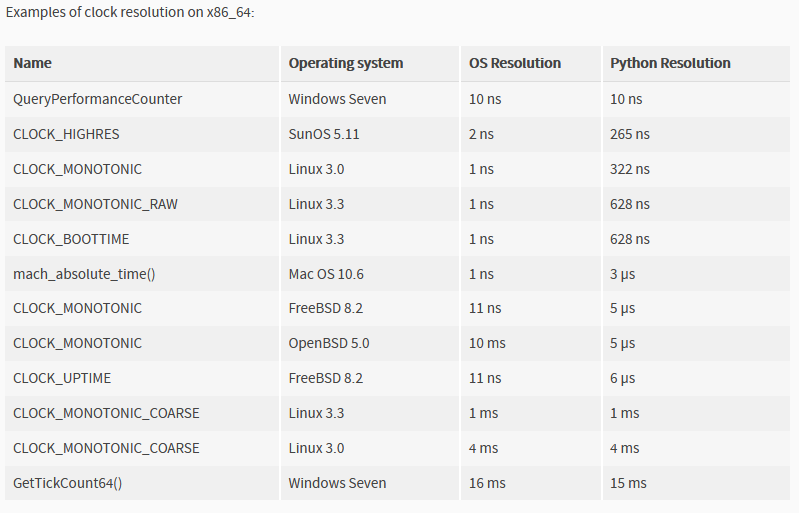
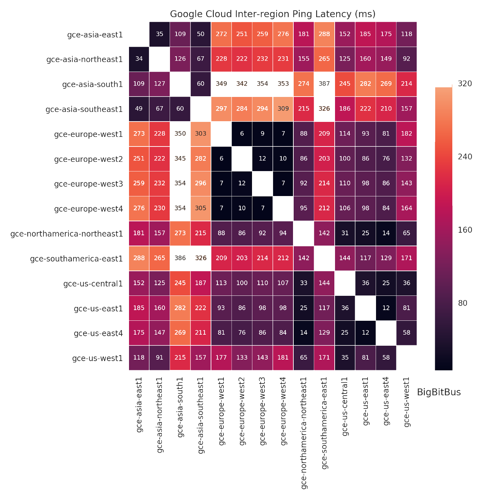

```{r setup, include=FALSE}
knitr::opts_chunk$set(out.height="70%",out.width="100%", dev.args=list(bg='transparent'))
```


```{r,echo=FALSE,warning=FALSE,message=FALSE,eval=FALSE}

#Run in console to install packages

libs = c("dplyr", "remotes", "ggplot2", "ggExtra", "lubridate", "fitdistrplus", "car", "qqplotr", "gganimate", "animation", "gifski", "magick", "kableExtra", "fGarch", "edfun", "VaRES")
for (l in libs) { if (!require(l)) { install.packages(l) } }

remotes::install_github("Issoufou-Liman/decisionSupportExtra")
#install.packages("https://cran.microsoft.com/snapshot/2019-06-20/bin/windows/contrib/3.6/gRain_1.3-0.zip")
```


```{r,echo=FALSE,warning=FALSE,message=FALSE}
library(knitr)
library(kableExtra)
library(ggplot2)
library(grid)
library(ggExtra)
library(RColorBrewer)
library(gridExtra)

options(scipen=999)

theme_l <- function(base_size = 11, base_family = "", base_line_size = base_size/22, base_rect_size = base_size/22)  {
    half_line <- base_size/2
    theme_bw(base_size = base_size, base_family = base_family, 
        base_line_size = base_line_size, base_rect_size = base_rect_size) %+replace% 
        theme(axis.line = element_line(colour = "black", size = rel(1)), 
            strip.background = element_rect(fill = "transparent", colour = "grey70", size = rel(2)),
            panel.background = element_rect(fill = "transparent", colour = NA), 
            panel.border = element_rect(fill = NA, colour = "grey70", size = rel(1)), panel.grid = element_line(colour = "grey87"), 
            plot.background = element_rect(fill = "transparent", colour = NA),
            legend.background = element_rect(fill = "transparent", colour = NA),
            legend.box.background = element_rect(fill = "transparent", colour = NA),
            panel.grid.major = element_line(size = rel(0.5)), 
            panel.grid.minor = element_line(size = rel(0.25)), 
            axis.ticks = element_line(colour = "grey70", size = rel(0.5)), 
            legend.key = element_rect(fill = "transparent", colour = NA), 
            strip.text = element_text(colour = "transparent", size = rel(0.8), margin = margin(0.8 * half_line, 
                  0.8 * half_line, 0.8 * half_line, 0.8 * half_line)), 
            complete = TRUE)
}
```

<style>
slide.backdrop {
  background: none !important;
  background-color: white !important;
}

div.huge {
  font-size: 2em !important;
}

div.footnotes {
  position: absolute;
  bottom: 0;
  margin-bottom: 10px;
  width: 80%;
  font-size: 0.5em;
}

div.smaller {
  font-size: 0.8em !important;
}

div.smallest {
  font-size: 0.6em !important;
  line-height: 1.4em !important;
}

</style>

<script src="https://ajax.googleapis.com/ajax/libs/jquery/3.1.1/jquery.min.js"></script>
<script>
$(document).ready(function() {
  $('slide:not(.backdrop):not(.title-slide)').append('<div class=\"footnotes\">');

  $('footnote').each(function(index) {
    var text  = $(this).html();
    var fnNum = (index+1).toString();
    $(this).html(fnNum.sup());

    var footnote   = fnNum + '. ' + text + '<br/>';
    var oldContent = $(this).parents('slide').children('div.footnotes').html();
    var newContent = oldContent + footnote;
    $(this).parents('slide').children('div.footnotes').html(newContent);
  });
  
  $('smaller').each(function(index) {
    var text  = $(this).html();
    $(this).html("<div class='smaller'>" + text +"</div>");
  });
  
  $('smallest').each(function(index) {
    var text  = $(this).html();
    $(this).html("<div class='smallest'>" + text +"</div>");
  });
  $('huge').each(function(index) {
    var text  = $(this).html();
    $(this).html("<div class='huge'>" + text +"</div>");
  });

});
</script>


## Summary

* What to look at

* How distributions look like

* How to measure

* How to investigate

<div class="notes">
<smallest>
- same as last year: programmer, not a data scientist, will try to share some of the things without claiming this is the best way<br>
- not about machine learning, but hopefully you'll learn at least one new trick<br>
- the most important message is to measure things and base your assumptions on facts. Then to know what you are measuring and to be aware of how you are measuring<br>
- background in trading, but applies to any software responding to events<br>
- just like in trading, the simple and common sense measures already capture most of the information, but the conclusion you can draw on limited information are not always right<br>
- most of the time the practice does not match the theory. many projects won't do what they should<br>
- there might be no "recipes" for your case. always look at the data. go with the effort/gains solution that best suits your project<br>
</smallest>
</div>


## Monitoring

{height=481px}

https://play.grafana.org/

<div class="notes">
<smallest>
- realtime monitoring sample taken from grafana frontpage<br>
- we have some number of requests, memory and CPU usage, time to load and size of requests<br>
- we'll talk mainly about the the time dimension<br>
- for the time to load a page we have the median and some quantiles, including the 90th and 95th and what's above that as a red area<br>
- we also have a historical average of those quantiles<br>
</smallest>
</div>

## Timelines

```{r,echo=FALSE,warning=FALSE,message=FALSE,cache=TRUE}
df <- read.csv("examples/sample_task_times.csv", stringsAsFactors=F, header=T)

df$time <- as.POSIXct(strptime(df$time_of_day, "%H:%M:%OS"))
attr(df$time, "tzone") <- "UTC"
df$proc_time <- df$proc_time_ms
df$idx <- as.numeric(row.names(df))
```


<span style="color:red;">
```{r,echo=FALSE,warning=FALSE,message=FALSE,cache=TRUE,out.width="75%"}
knitr::asis_output("\U274C")
```
</span>

```{r,echo=FALSE,warning=FALSE,message=FALSE,cache=TRUE,out.width="75%"}
mdf <- matrix(df$proc_time[1:(floor(nrow(df)/100)*100)], 100)

mf <- data.frame(cbind(index=1:nrow(mdf), 
                       p25=apply(mdf, 2, function(x) quantile(x, 0.25)),
                       p50=apply(mdf, 2, function(x) quantile(x, 0.50)),
                       p75=apply(mdf, 2, function(x) quantile(x, 0.75)),
                       p90=apply(mdf, 2, function(x) quantile(x, 0.90)),
                       p95=apply(mdf, 2, function(x) quantile(x, 0.95))))

colors <- colorRampPalette(brewer.pal(8, "YlOrRd"))(6)

ggplot(mf) + 
  geom_bar(stat="identity", aes(x=index, y=p95), fill=colors[5]) +
  geom_bar(stat="identity", aes(x=index, y=p90), fill=colors[4]) +
  geom_bar(stat="identity", aes(x=index, y=p75), fill=colors[3]) + 
  geom_bar(stat="identity", aes(x=index, y=p50), fill=colors[2]) +
  geom_bar(stat="identity", aes(x=index, y=p25), fill=colors[1]) +
  labs(title="Timeline") + xlab("Index") + ylab("Processing Time (ms)") + 
  theme_l() + theme(aspect.ratio=0.5, legend.position="none")

```

<div class="notes">
<smallest>
- will present several ways to chart things and show also how easy we can make mistakes and get a distorted image reality<br>
- this is post hoc analysis not realtime as in the previous screen, but the same principles apply<br>
- taking a sample of processing times from a system that occasionally goes to the DB<br>
- doing the same type of analysis as in the previous chart<br>
- similar quantlies as in grafana, but it's not quite the same, as i take only the quantiles, not showing the max<br>
- also i dropped the time component and created equal sized buckets for the sake of example<br>
</smallest>
</div>

## Timelines

<span style="color:red;">
```{r,echo=FALSE,warning=FALSE,message=FALSE,cache=TRUE,out.width="75%"}
knitr::asis_output("\U274C")
```
</span>
 
```{r,echo=FALSE,warning=FALSE,message=FALSE,cache=TRUE,out.width="75%"}
ggplot(df, aes(x=idx, y=proc_time)) + geom_point(size=.8, color="darkred", alpha=1) + 
  labs(title="Timeline") + xlab("Index") + ylab("Processing Time (ms)") + 
  theme_l() + theme(aspect.ratio=0.5, legend.position="none")
```

<div class="notes">
<smallest>
- what if we plot all observations<br>
- comparing to the previous chart, it tells us that, in reality, we lost sight of the red dots we see here. so we shouldn't have dropped it <br>
- still, this chart is not very readable and does not say much<br>
</smallest>
</div>

## Timelines

<span style="color:green;">
```{r,echo=FALSE,warning=FALSE,message=FALSE,cache=TRUE,out.width="75%"}
knitr::asis_output("\U2713")
```
</span>
   
```{r,echo=FALSE,warning=FALSE,message=FALSE,cache=TRUE,out.width="75%"}
p2 <- ggplot(df, aes(x=idx, y=proc_time)) + geom_point(size=.8, alpha=.2, color="darkred") + 
  labs(title="Timeline") + xlab("Index") + ylab("Processing Time (ms)") + 
  theme_l() + theme(aspect.ratio=0.5, legend.position="none") + scale_y_continuous(trans='log10')
ggMarginal(p2, type="density", groupFill=F, size=10, margins="y", col="gray", fill="gray", alpha=.2)
```

<div class="notes">
<smallest>
- use a log scale and add transparency<br>
- add density<br>
</smallest>
</div>

## Timelines

```{r,echo=FALSE,warning=FALSE,message=FALSE,cache=TRUE,out.width="75%"}
colors <- colorRampPalette(brewer.pal(8, "YlOrRd"))(7)
quantiles <- quantile(df$proc_time, prob=c(0.10, 0.25, 0.50, 0.75, 0.90, 0.95, 1))
df$q <- findInterval(df$proc_time, quantiles)

p2 <- ggplot(df, aes(x=idx, y=proc_time)) + geom_point(size=.8, alpha=.3, aes(colour=q)) + 
  labs(title="Timeline") + xlab("Index") + ylab("Processing Time (ms)") + 
  scale_color_gradientn(colours=colors) +
  theme_l() + theme(aspect.ratio=0.5, legend.position="none") + scale_y_continuous(trans='log10')
ggMarginal(p2, type="density", groupFill=F, size=10, margins="y", col="gray", fill="gray", alpha=.2)
```

<div class="notes">
<smallest>
- if you really want colors, you can color by quantile<br>
- but is just eye catchy and makes you not process the information better<br>
- we compute quantiles over the whole interval, we don't average<br>
- timelines can reveals patterns, but still too noisy to make an assessment about performance<br>
- we call it a timeline, but we actually lost the time domain<br>
- always add your unit of measure in charts<br>
</smallest>
</div>


## Histograms

<span style="color:red;">
```{r,echo=FALSE,warning=FALSE,message=FALSE,cache=TRUE,out.width="75%"}
knitr::asis_output("\U274C")
```
</span>

```{r,echo=FALSE,warning=FALSE,message=FALSE,cache=TRUE,out.width="75%"}

ggplot(df, aes(x=proc_time)) + geom_histogram(binwidth=.2, color="darkred", fill="red", alpha=.3) + theme_l()  + theme(aspect.ratio=1) + xlab("Processing Time (ms)") + ylab("Count")

```

<div class="notes">
<smallest>
- useless histogram, no information can be read from here<br>
</smallest>
</div>


## Histograms 

<span style="color:red;">
```{r,echo=FALSE,warning=FALSE,message=FALSE,cache=TRUE,out.width="75%"}
knitr::asis_output("\U274C")
```
</span>

```{r,echo=FALSE,warning=FALSE,message=FALSE,cache=TRUE,out.width="75%"}
ggplot(df[df$proc_time<20,], aes(x=proc_time)) + geom_histogram(binwidth=.2, color="darkred", fill="red", alpha=.3) + theme_l()  + theme(aspect.ratio=1) + xlab("Processing Time (ms)") + ylab("Count")

```

<div class="notes">
<smallest>
- some people add a cut-off, but it's wrong to just discard information<br>
- however, you can see the shape of the distribution<br>
</smallest>
</div>

## Histograms 

```{r,echo=FALSE,warning=FALSE,message=FALSE,cache=TRUE,out.width="75%"}
ggplot(df, aes(x=proc_time)) + geom_histogram(binwidth=.1, color="darkred", fill="red", alpha=.3) + theme_l()  + theme(aspect.ratio=1) + scale_x_continuous(trans='log10') + xlab("Processing Time (ms)") + ylab("Count")

```

<div class="notes">
<smallest>
- histogram with log scale, in this case only on the x axis, not for the frequency<br>
- use the same scales in multiple experiments<br>
</smallest>
</div>

## Histograms 

<span style="color:green;">
```{r,echo=FALSE,warning=FALSE,message=FALSE,cache=TRUE,out.width="75%"}
knitr::asis_output("\U2713 ?")
```
</span>

```{r,echo=FALSE,warning=FALSE,message=FALSE,cache=TRUE,out.width="75%"}
ggplot(df, aes(x=proc_time)) + geom_histogram(binwidth=.015, fill="red", alpha=.3) + theme_l()  + theme(aspect.ratio=1) + scale_x_continuous(trans='log10') + xlab("Processing Time (ms)") + ylab("Count")

```

<div class="notes">
<smallest>
- but beware of bin size (or number of bins), as it can hide important information<br>
- in this histogram it's not really the case, but we can see that the distribution is actually multimodal<br>
</smallest>
</div>

## Histograms

```{r,echo=FALSE,warning=FALSE,message=FALSE,cache=TRUE,out.width="75%"}
t <- table(floor(df$proc_time * 25)/25)
dt <- data.frame(cbind(time=as.numeric(rownames(t)), count=t))
p1 <- ggplot(dt, aes(x=time, y=count)) + geom_point(col="darkred", size=.8, alpha=.3) + 
  theme_l()  + theme(aspect.ratio=1) + scale_x_continuous(trans='log10') + scale_y_continuous(trans='log10') +  
  xlab("Processing Time (ms)") + ylab("Count")
ggMarginal(p1, type="density", groupFill=F, size=10, margins="both", col="gray", fill="gray", alpha=.2)

```

<div class="notes">
<smallest>
- log scale both for the time and frequency domain<br>
- add densities to both axes<br>
- the multimodal nature of processing times becomes more visible<br>
- beware of the density plots: they are artificial. the one on the x-axis for example counts number of buckets! it's just a helper to notice agglomeration of points. A point with a high frequency would stand out of the crowd in the chart, agglomerations of buckets with low frequency can become visible in the density chart<br>
- takes a bit to get accustomed, but become easy to read after<br>
</smallest>
</div>


## Histograms

{width=581px}


<smallest>Tivnan et al. - Price Discovery and the Accuracy of Consolidated Data Feeds in the U.S. Equity Markets, Journal of Risk and Financial Management, 2018<footnote>https://www.mdpi.com/1911-8074/11/4/73/htm</footnote></smallest>

<div class="notes">
<smallest>
- becomes more useful when comparing multiple sources<br>
- here we compare different exchanges, simlarly you could compare different days, machines or releases
</smallest>
</div>

## Quantiles plots

```{r,echo=FALSE,warning=FALSE,message=FALSE,cache=TRUE,out.width="75%"}
q <- c(0.9, 0.99, 0.999, 0.9999, 0.99999)
qfp <- as.data.frame(quantile(df$proc_time, q))
colnames(qfp)[1] <- "proc_time"
qfp$quantile <- rownames(qfp)

ggplot(qfp, aes(x=quantile, y=proc_time)) + geom_point(col="darkred") + 
  geom_segment(aes(x=quantile[1], y=proc_time[1], xend=quantile[2], yend=proc_time[2], colour="darkred"), alpha=.1) +
  geom_segment(aes(x=quantile[2], y=proc_time[2], xend=quantile[3], yend=proc_time[3], colour="darkred"), alpha=.1) +
  geom_segment(aes(x=quantile[3], y=proc_time[3], xend=quantile[4], yend=proc_time[4], colour="darkred"), alpha=.1) +
  geom_segment(aes(x=quantile[4], y=proc_time[4], xend=quantile[5], yend=proc_time[5], colour="darkred"), alpha=.1) +
  theme_l() + theme(aspect.ratio=1, legend.position="none") + scale_y_continuous(trans='log10') + 
  xlab("Quantile") + ylab("Processing Time (ms)")

```

<div class="notes">
<smallest>
- quantile plot, not QQ-plot<br>
- plot quantiles, even spaced usually, log scale on the time dimension, here on the Y axis<br>
- sometimes looking at more quantiles are needed<br>
- histograms and timelines can reveal some things, but sometimes it's not enough<br>
- linear arrangement means exponential decay in the tail of the distribution. concave is a faster decay<br>
</smallest>
</div>

## Quantiles plots

```{r,echo=FALSE,warning=FALSE,message=FALSE,cache=TRUE,out.width="75%"}
qfp$over_quantile <- unlist(lapply(qfp$proc_time, function(x) mean(df$proc_time[df$proc_time >= x])))

ggplot(qfp, aes(x=proc_time, y=quantile)) +
  geom_bar(stat="identity", aes(x=over_quantile, y=quantile), fill="red", alpha=.5) +
  geom_bar(stat="identity", aes(x=proc_time, y=quantile), fill="red", alpha=.5) + 
  scale_x_continuous(trans='log10') +
  scale_y_discrete(limits = rev(rownames(qfp))) +
  theme_l() + theme(aspect.ratio=0.5) + 
  ylab("Quantile") + xlab("Processing Time (ms)")

```

<div class="notes">
<smallest>
- switched the time dimension to the x axis<br>
- plot percentiles and the average time over percentile<br>
- note: this is not an average of percentiles like in grafana. Just like max values, percentiles (including median),  should not be averaged<br>
- center of mass of the tail (of the discrete distribution)<br>
</smallest>
</div>


## Distribution tail plot

<span style="color:green;">
```{r,echo=FALSE,warning=FALSE,message=FALSE,cache=TRUE,out.width="75%"}
knitr::asis_output("\U2713")
```
</span>

```{r,echo=FALSE,warning=FALSE,message=FALSE,cache=TRUE,out.width="75%"}
dg <- df[order(df$proc_time),]
dg$idx <- seq(1, nrow(dg))
dg$pct <- dg$idx / nrow(dg)
dg$inv_pct <- 1 / (1 - dg$pct)

ggplot(dg[dg$pct >= 0.90,], aes(x=inv_pct, y=proc_time)) +
  geom_line(color="darkred") +
  scale_x_continuous(trans='log10', labels=function(x) (100*(1-1/x))) + scale_y_continuous(trans='log10') + 
  xlab("Quantile") + ylab("Processing Time (ms)") + 
  theme_l() + theme(aspect.ratio=0.5, legend.position="none")
```

<div class="notes">
<smallest>
- looking at the whole tail of the distribution above 90th percentile<br>
- very useful when comparing different runs<br>
- we do not drop the max or any other high quantile<br>
- it's true that min/max values are very often special cases, sometimes measurement errors, but the solution is to check and explain them, not to drop<br>
- again the we're having log scale on both axis. it's common not to use log scale on the y axis<br>
- we will get back to the quantiles plots later<br>
</smallest>
</div>

## Chart by factors

```{r,echo=FALSE,warning=FALSE,message=FALSE,cache=TRUE,out.width="75%"}
library(lubridate)
library(scales)

p3 <- ggplot(df, aes(x=time, y=proc_time)) + geom_point(size=.8, aes(colour=q), alpha=.3) + 
  labs(title="Daily Timeline") + xlab("Time of Day") + ylab("Processing Time (ms)") + 
  theme_l() + theme(aspect.ratio=0.5, legend.position="none") +
  scale_y_continuous(trans='log10') + 
  scale_color_gradientn(colours=colors) +
  scale_x_datetime(labels = date_format("%H:%M", tz="Europe/Bucharest"), breaks = date_breaks("4 hour"))
ggMarginal(p3, type="density", groupFill=F, size=10, margins="both", col="gray", fill="gray", alpha=.2)
```


<div class="notes">
<smallest>
- we recovered time, but just the time of day<br>
- still having a log scale<br>
- plot by factors you know that can have an influence on your servers<br>
- sample here with plos by time of day, but could be anything that you think to be relevant<br>
</smallest>
</div>

## Chart by factors

{width=900px}

<smallest>Hasbrouck J., Saar G., Low-latency trading, Journal of Financial Markets, 2013 <footnote>https://www.erim.eur.nl/fileadmin/erim_content/documents/Saar_Nov6.pdf</footnote></smallest>

<div class="notes">
<smallest>
- another example, by looking only at the millisecond part of the transaction times, the relative amount of actions happening at round times becomes visible<br>
- horizontal gray line is the null hypothesis, a uniform distribution assumption<br>
- fixed hours schedules, increased volumes at open, colocation etc.
- as well as some possible time desynchronizations visible at the 1sec boundary<br>
</smallest>
</div>

## Take a step back

What are we measuring?

- processing times
- roundtrip times

{width=546px}

<smallest>(c) Andrei Pandele</smallest>

<div class="notes">
<smallest>
- we can measure the time it takes to serve one person or the time a person waits<br>
- there are multiple stages: transport time, delay until the first block of information processed, processing time, transport time again<br>
- sometimes systems work with partial data and this is complicates the picture even more: till the first bit of processed data is received or till the whole data arrived<br>
- latency sometimes stands for the whole time until the data is processed<br>
- what you measure depends on your use cases, but try to log everything, including steps of complicated distribution paths.
</smallest>
</div>

## Coordinated omission 

Gil Tene - "How NOT to Measure Latency"<footnote>https://www.youtube.com/watch?v=lJ8ydIuPFeU&t=15m50</footnote>

{width=546px}

<div class="notes">
<smallest>
- coordinated omission: individual processing time (service time) versus time to completion<br>
- one freeze in this code (GC, I/O freezing, DB lock or reindexing, context switch, interrupt) would be counted only once and it will look good for all instances except one<br>
- if happens outside the timed section, it's not even reported<br>
- time to completion can be biased by a single slow instance as delays add up. queueing: threads or microservices have similar issues<br>
- most monitoring tools are build to show processing time (sometimes called service time) and most performance optimizations and benchmarking done by developers is for the server side, looking only at processing time<br>
- the transport time and waiting time are usually omitted. always measure all parts, including the full rountrip time (or response time)<br>
- when trading you have multiple loops with different distribution chains: there's a roundtrip until you get an acknowledgement from the broker and one till you see the order you placed in market data<br>
- you still need profiling and processing time, but it's not enough. Measure everything<br>
</smallest>
</div>


## Coordinated omission 

```{r,echo=FALSE,warning=FALSE,message=FALSE,cache=TRUE,out.width="75%"}

dco <- read.csv("examples/03.sample_throughput1.csv", stringsAsFactors=F, header=T)

dco1 <- dco[order(dco$RemoteProcessingTime),]
dco1$idx <- seq(1, nrow(dco1))
dco1$pct <- dco1$idx / nrow(dco1)
dco1$inv_pct <- 1 / (1 - dco1$pct)

dco2 <- dco[order(dco$LocalTimeDiffMs),]
dco2$idx <- seq(1, nrow(dco2))
dco2$pct <- dco2$idx / nrow(dco2)
dco2$inv_pct <- 1 / (1 - dco2$pct)

dc1 <- ggplot(dco1[dco1$pct >= 0.90,], aes(x=inv_pct, y=RemoteProcessingTime)) +
  geom_line(color="darkred") +
  scale_x_continuous(trans='log10', labels=function(x) (100*(1-1/x))) + scale_y_continuous(trans='log10') + 
  xlab("Quantile") + ylab("Processing Time (ms)") + 
  theme_l() + theme(aspect.ratio=0.5, legend.position="none") +
  theme(axis.title.y=element_text(size=rel(0.75)), axis.title.x=element_text(size=rel(0.75)))

dc2 <- ggplot(dco2[dco2$pct >= 0.90,], aes(x=inv_pct, y=LocalTimeDiffMs)) +
  geom_line(color="darkred") +
  scale_x_continuous(trans='log10', labels=function(x) (100*(1-1/x))) + scale_y_continuous(trans='log10') + 
  xlab("Quantile") + ylab("Roundtrip Time (ms)") + 
  theme_l() + theme(aspect.ratio=0.5, legend.position="none") +
  theme(axis.title.y=element_text(size=rel(0.75)), axis.title.x=element_text(size=rel(0.75)))


t1 <- table(floor(dco$RemoteProcessingTime * 1000)/1000)
dh1 <- data.frame(cbind(time=as.numeric(rownames(t1)), count=t1))
dch1 <- ggplot(dh1, aes(x=time, y=count)) + geom_point(col="darkred", size=.25, alpha=.3) + 
  theme_l()  + theme(aspect.ratio=0.5) + scale_x_continuous(trans='log10') + scale_y_continuous(trans='log10') +  
  xlab("Processing Time (ms)") + ylab("Count") +
  theme(axis.title.y=element_text(size=rel(0.75)), axis.title.x=element_text(size=rel(0.75)))
h1 <- ggMarginal(dch1, type="density", groupFill=F, size=10, margins="both", col="gray", fill="gray", alpha=.2)

t2 <- table(floor(dco$LocalTimeDiffMs * 25)/25)
dh2 <- data.frame(cbind(time=as.numeric(rownames(t2)), count=t2))
dch2 <- ggplot(dh2, aes(x=time, y=count)) + geom_point(col="darkred", size=.25, alpha=.3) + 
  theme_l()  + theme(aspect.ratio=0.5) + scale_x_continuous(trans='log10') + scale_y_continuous(trans='log10') +  
  xlab("Roundtrip Time (ms)") + ylab("Count") +
  theme(axis.title.y=element_text(size=rel(0.75)), axis.title.x=element_text(size=rel(0.75)))
h2 <- ggMarginal(dch2, type="density", groupFill=F, size=10, margins="both", col="gray", fill="gray", alpha=.2)

grid.arrange(dc1, h1, dc2, h2, ncol=2)
```


<div class="notes">
<smallest>
- example data in the charts above are from a (pretty dumb) single server that can sustain a throughput of 100 messages per second and has requests from clients at the same rate (100/s)<br>
- the catch is that we have 10 clients sending requests in bursts<br>
- in the top charts we can see how the measurements for processing time and below we see the measurements for the full roundtrips<br>
- we can see how the measurements look way too good for the processing time, while in reality the actual consumer experience is much more painful<br>
- from the shape of the tail you can already tell in which case we are looking at processing times and not at roundtrips, or we have a single consumer and we're way below the throughput rate<br>
- there are delays in the upper chart although i used a 10ms sleep. such delays can have many factors: from cpu overload, to network congestions, synchronization issues or garbage collection to name just a few<br>
- sudden jumps when looking at percentiles usually tell you're dealing with processing times and your measurements might be misleading<br>
</smallest>
</div>

## Why not averages and few percentiles?

<span style="color:red;">
```{r,echo=FALSE,warning=FALSE,message=FALSE,cache=TRUE,out.width="75%"}
knitr::asis_output("\U274C")
```
</span>

```{r,echo=FALSE,warning=FALSE,message=FALSE,cache=TRUE,out.width="75%"}
q1 <- round(quantile(dco$RemoteProcessingTime, prob=c(0.50, 0.75, 0.90, 0.95, 0.99)), 2)
avg1 <- round(mean(dco$RemoteProcessingTime), 2)
sd1 <- round(sd(dco$RemoteProcessingTime), 2)
q2 <- round(quantile(dco$LocalTimeDiffMs, prob=c(0.50, 0.75, 0.90, 0.95, 0.99)), 2)
avg2 <- round(mean(dco$LocalTimeDiffMs), 2)
sd2 <- round(sd(dco$LocalTimeDiffMs), 2)

qd <- as.data.frame(cbind("Processing Time"=q1, "Roundtrip Time"=q2))
qd <- rbind(Average=c(avg1, avg2), Stdev=c(sd1, sd2), qd)

dbc <- as.data.frame(cbind.data.frame(
  Time=as.numeric(c(dco$RemoteProcessingTime, dco$LocalTimeDiffMs)),
  Measure=c(rep("Processing Time", nrow(dco)), rep("Roundtrip Time", nrow(dco)))))

pc1 <- ggplot(dbc, aes(Measure, Time)) + 
  geom_boxplot(aes(colour=Measure), size=0.5, alpha=0.1, outlier.shape=NA) + 
  theme_light() + theme(aspect.ratio=1, legend.position="none") 

#kt <- knitr::kable(qd)
grid.arrange(tableGrob(qd), pc1, ncol=2)

```

<div class="notes">
<smallest>
- notice how the numbers, including the 95th and 99th percentile are a nice lie that is decoupled from reality<br>
- upper quantiles are more informative for full roundtrips than for processing time<br>
- should we stop reporting those numbers? no, they are still useful on their own, but they are not enough<br>
- in this example i did not had a huge max, but dropping the max in processing times is another mistake, because it has a ripple effect<br>
- client side delays are serially correlated. can use the Ljung-Box statistical test to see how correlated they are and compare between versions<br>
</smallest>
</div>

## What does the 99th percentile mean?

Whatsapp (2018)

<smaller>
~65 billion messages per day<br>
~500M daily active users<br>
Assuming iid delays and avg # requests per user, 99th percentile slowness will affect (1 - 0.99^(65/0.5)) = 72% of the users
</smaller>

Depending on the number of requests per client:

```{r,echo=FALSE,warning=FALSE,message=FALSE,cache=TRUE,out.width="75%"}
req <- c(1, 10, 100, 1000, 1000, 10000, 1000000)
pct <- c(0.95, 0.99, 0.999, 0.9999, 0.99999, 0.999999)

mp <- matrix(unlist(lapply(req, function(x) paste(round(100 * (1-pct^x), 2), "%", sep=""))), nrow=length(pct))
mp[mp=="100%"] <- ">99%"
mp[mp=="0%"] <- "<0.01%"
colnames(mp) <- req
rownames(mp) <- pct * 100

tg <- tableGrob(mp)
h <- unit.c(sum(tg$heights), unit(1,"null"))
grid.arrange(tg, heights=h)

```


<div class="notes">
<smallest>
- certain software can be ok by just looking at the 99th percentile and optimizing that. Or just at averages, but if you've seen this presentation, don't go there<br>
- 95th and 99th percentile are not that rare, assume a trading app placing hundreds of orders per minute<br>
- whatsapp example is biased. Of course the issues are localized and the number of messages for each user is decaying exponentially depending on the user persona, but is an example. Assuming independent samples, the probability of a user experiencing that slowness of over 99th pct is very high<br>
- these delays affecting the users are the roundtrips. By looking only at processing time, you underestimate the impact a lot<br>
- looking at processing time remains very important, but also measure roundtrips and throughput and always be aware what you measure<br>
</div>


## Grafana dashboard again

{height=481px}

<div class="notes">
<smallest>
- getting back to grafana example<br>
- "client side full page load", which suggests monitoring roundtrips, which is good<br>
- looking at several quantiles, which is ok but not quite, ignoring everything above 95th percentile is dangerous, leaves out quite a lot of cases<br>
- computing averages of quantiles: not ok<br>
- extremes do not have a central tendency, hence they should not be not averaged<br>
- assume you still want a condensed single number, two approaches: "block maxima" which gives rise to a Generalized Extreme Value distribution, and "peak over threshold" that gives rise to a Generalized Pareto distribution, on which you then can fit a parametric model and estimate a higher quantile<br>
</smallest>
</div>


## Visualize the distribution

```{r,echo=FALSE,warning=FALSE,message=FALSE,cache=TRUE,out.width="75%"}
#library(fitdistrplus)
#library(decisionSupportExtra)
source("examples/ggplot_descdist.R")
#descdist(df$proc_time, discrete=FALSE, boot=1000)

p1 <- ggplot(dco, aes(x=RemoteProcessingTime)) + geom_histogram(binwidth=.002, fill="red", alpha=.3) + theme_l()  + theme(aspect.ratio=0.5) + scale_x_continuous(trans='log10') + xlab("Processing Time (ms)") + ylab("Count")
p2 <- ggplot(dco, aes(x=LocalTimeDiffMs)) + geom_histogram(binwidth=0.01, fill="red", alpha=.3) + theme_l()  + theme(aspect.ratio=0.5) + scale_x_continuous(trans='log10') + xlab("Roundtrip Time (ms)") + ylab("Count")

p3 <- ggplot(dco, aes(x=RemoteProcessingTime)) + stat_ecdf(color="darkred") + theme_l() + theme(aspect.ratio=0.5) + 
  scale_x_continuous(trans='log10') + xlab("Processing Time (ms)") + ylab("CDF") +
  theme(axis.title.y=element_text(size=rel(0.75)), axis.title.x=element_text(size=rel(0.75)))

p4 <- ggplot(dco, aes(x=LocalTimeDiffMs)) + stat_ecdf(color="darkred") + theme_l() + theme(aspect.ratio=0.5) + 
  scale_x_continuous(trans='log10') + xlab("Roundtrip Time (ms)") + ylab("CDF") +
  theme(axis.title.y=element_text(size=rel(0.75)), axis.title.x=element_text(size=rel(0.75)))

grid.arrange(p1, p2, ncol=1)
```

<div class="notes">
<smallest>
- don't look only at few numbers. always check the full distribution, you might find unexpected patterns as in this case<br>
- strange artefacts like in this chart because of the artificial example: client requests made in bursts, 10ms apart, and they all wait for the same resource that takes ~10ms to compute. Useless information in this case, but if you have strange patterns, in your case it might be more relevant<br>
- normally when there are many underlying factors the distribution is smooth<br>
- can have artefacts also due to clocks resolutions, to which we'll get back later<br>
- how distributions usually look like: no simple answer, we will get back to this. processing times versus roundtrip times will obviously be different<br>
- usually both have multiple humps (are multimodal), because multiple factors trigger delays<br>
- usually have an exponentially decaying tail. processing times will have more abrupt decay as the serial correlation is weaker<br>
- only positive numbers (which is always a good thing to check)<br>
</smallest>
</div>


## Visualize the distribution

```{r,echo=FALSE,warning=FALSE,message=FALSE,cache=TRUE,out.width="75%"}
grid.arrange(dch1, dch2, p3, p4, ncol=2)
```

<div class="notes">
<smallest>
- always look at the distribution in different ways, both ways to plot histograms presented and the Cumulative Distribution Function plot are helpful<br>
- also the quantiles or the distribution tails plot shown earlier<br>
- from a CDF chart like this you can see by the concave shape of the CDF that we've hit the throughput limit. we will get back to this<br>
</smallest>
</div>

## Distribution tails

Throughput

```{r,echo=FALSE,warning=FALSE,message=FALSE,cache=TRUE,out.width="75%"}

dco2 <- read.csv("examples/03.sample_throughput2.csv", stringsAsFactors=F, header=T)
dco3 <- read.csv("examples/03.sample_throughput3.csv", stringsAsFactors=F, header=T)
dco4 <- read.csv("examples/03.sample_throughput4.csv", stringsAsFactors=F, header=T)
dco5 <- read.csv("examples/03.sample_throughput5.csv", stringsAsFactors=F, header=T)

dg <- dco[order(dco$LocalTimeDiffMs),]
dg$idx <- seq(1, nrow(dg))
dg$pct <- dg$idx / nrow(dg)
dg$inv_pct <- 1 / (1 - dg$pct)

pct_limit <- 0.75

p1 <- ggplot(dg[dg$pct >= pct_limit,], aes(x=inv_pct, y=LocalTimeDiffMs)) +
  geom_line(color="darkred") +
  scale_x_continuous(trans='log10', labels=function(x) (100*(1-1/x))) + scale_y_continuous(trans='log10') + 
  xlab("Quantile") + ylab("Roundtrip Time (ms)") + ggtitle("10x above with cooldown") +
  theme_l() + theme(aspect.ratio=0.5, legend.position="none") +
  theme(axis.title.y=element_text(size=rel(0.75)), axis.title.x=element_text(size=rel(0.75)))

dg <- dco2[order(dco2$LocalTimeDiffMs),]
dg$idx <- seq(1, nrow(dg))
dg$pct <- dg$idx / nrow(dg)
dg$inv_pct <- 1 / (1 - dg$pct)


p2 <- ggplot(dg[dg$pct >= pct_limit,], aes(x=inv_pct, y=LocalTimeDiffMs)) +
  geom_line(color="darkred") +
  scale_x_continuous(trans='log10', labels=function(x) (100*(1-1/x))) + scale_y_continuous(trans='log10') + 
  xlab("Quantile") + ylab("Roundtrip Time (ms)") + ggtitle("at") +
  theme_l() + theme(aspect.ratio=0.5, legend.position="none") +
  theme(axis.title.y=element_text(size=rel(0.75)), axis.title.x=element_text(size=rel(0.75)))

dg <- dco4[order(dco4$LocalTimeDiffMs),]
dg$idx <- seq(1, nrow(dg))
dg$pct <- dg$idx / nrow(dg)
dg$inv_pct <- 1 / (1 - dg$pct)

p3 <- ggplot(dg[dg$pct >= pct_limit,], aes(x=inv_pct, y=LocalTimeDiffMs)) +
  geom_line(color="darkred") +
  scale_x_continuous(trans='log10', labels=function(x) (100*(1-1/x))) + scale_y_continuous(trans='log10') + 
  xlab("Quantile") + ylab("Roundtrip Time (ms)")  + ggtitle("1/2 below") +
  theme_l() + theme(aspect.ratio=0.5, legend.position="none") +
  theme(axis.title.y=element_text(size=rel(0.75)), axis.title.x=element_text(size=rel(0.75)))


dg <- dco3[order(dco3$LocalTimeDiffMs),]
dg$idx <- seq(1, nrow(dg))
dg$pct <- dg$idx / nrow(dg)
dg$inv_pct <- 1 / (1 - dg$pct)

p4 <- ggplot(dg[dg$pct >= pct_limit,], aes(x=inv_pct, y=LocalTimeDiffMs)) +
  geom_line(color="darkred") +
  scale_x_continuous(trans='log10', labels=function(x) (100*(1-1/x))) + scale_y_continuous(trans='log10') + 
  xlab("Quantile") + ylab("Roundtrip Time (ms)")  + ggtitle("Slightly below") +
  theme_l() + theme(aspect.ratio=0.5, legend.position="none") +
  theme(axis.title.y=element_text(size=rel(0.75)), axis.title.x=element_text(size=rel(0.75)))


dg <- dco5[order(dco5$LocalTimeDiffMs),]
dg$idx <- seq(1, nrow(dg))
dg$pct <- dg$idx / nrow(dg)
dg$inv_pct <- 1 / (1 - dg$pct)

p5 <- ggplot(dg[dg$pct >= pct_limit,], aes(x=inv_pct, y=LocalTimeDiffMs)) +
  geom_line(color="darkred") +
  scale_x_continuous(trans='log10', labels=function(x) (100*(1-1/x))) + scale_y_continuous(trans='log10') + 
  xlab("Quantile") + ylab("Roundtrip Time (ms)")  + ggtitle("Slightly above") +
  theme_l() + theme(aspect.ratio=0.5, legend.position="none") +
  theme(axis.title.y=element_text(size=rel(0.75)), axis.title.x=element_text(size=rel(0.75)))

grid.arrange(p1, p5, p3, p4, ncol=2)

```

<div class="notes">
<smallest>
- this gets us to throughput: how to diagnose when delays are mainly due to factors specific to your system<br>
- look at roundtrip times and plot the distribution tails<br>
- the same artificial experiment with clients making requests<br>
- sleeps used in the code are a source for the steps at round milliseconds<br>
- compare the distribution tails plots: upper left is the data already seen, 10x the throughput, top right is only 10% above the throughput and below we do not reach that rate<br>
- the 10x Above example looks already really bad starting with the 90th percentile<br>
- difference between charts below the throughput rate should be small and mainly due to random factors<br>
- finding the breaking point: where the chart changes from approximatively linear or convex to concave<br>
- when things start queueing the chart becomes concave, full roundtrip times accumulate. What to do: collapsing requests, spawning new instances for horizontal scaling
</smallest>
</div>

## Comparing performance

Comparing messaging systems performance

{width=681px}


<smallest>https://bravenewgeek.com/tag/coordinated-omission/</smallest>

<div class="notes">
<smallest>
- some people don't look just at the tail and chart the whole distribution like here<br>
- compare latencies between different real life experiments. You can as well compare different versions of your app or different runs<br>
- here were tested messaging systems with 1KB size at 3K/sec or 5KB size at 2K/s
</smallest>
</div>

## How distributions look like

Example 1: processing times

```{r,echo=FALSE,warning=FALSE,message=FALSE,cache=TRUE,out.width="75%"}
set.seed(1234)
ggplot_descdist(df$proc_time, boot=500, obs.col="blue", boot.col="orange") +
  theme_l()  + theme(aspect.ratio=1)

```

<div class="notes">
<smallest>
- in addition to that fit your distribution. The Cullen-Frey chart is useful to put a label to your data. Parametric distributions are "fictions" simplifying the reality. "the map is not the territory" but these simplifications can be useful for predicting probabilities, forecast occurences or identify regime changes. We have a distribution close to gamma in this case<br>
- using here processing times. when using processing times there is serial correlation, but clearly not like for roundtrips<br>
- Square of fitness vs kurtosis chart. Skewness: the 3rd moment of a distribution, a measure of asymmetry of the distribution, kurtosis: the 4th moment of the distribution: not so much about how the peak looks like, but how thin or fat are the tails. A normal distribution will have a value of 3<br>
- can think of distribution moments as the taylor expansion of a function, estimating the distribution better and better<br>
- does not really make sense to go higher than kurtosis, at most to  the 5th moment, measuring the asymmetry of the tails, used in finance<br>
- this chart is a useful tool, but it's not a bullet-proof one. It looks only at two shape params. use larger sample sizes, as kurtosis is very sensitive to outliers for small samples<br>
- use bootstrapping when checking distributions or computing numbers: ok for the central tendency or variance. mention random forests as an example of bootstrapping success<br>
</smallest>
</div>


## How distributions look like

```{r,echo=FALSE,warning=FALSE,message=FALSE,cache=TRUE,out.width="75%"}
library(car)
library(fitdistrplus)

fg <- fitdist(df$proc_time, "gamma", method="mle") 
fw <- fitdist(df$proc_time, "weibull", method="mle")
fl <- fitdist(df$proc_time, "lnorm", method="mle")

binwidth <- 0.01

p1 <- ggplot(df, aes(x=proc_time)) + geom_histogram(binwidth=binwidth, fill="red", alpha=.3) + 
  theme_l() + theme(aspect.ratio=1) + 
  scale_x_continuous(trans='log10') + xlab("Processing Time (ms)") + ylab("Count") + 
  stat_function(fun = function(z)(dgamma(z, fg$estimate[1], fg$estimate[2]) * sum(df$proc_time) * binwidth), colour="darkred") +
  stat_function(fun = function(z)(dlnorm(z, fl$estimate[1], fl$estimate[2]) * sum(df$proc_time) * binwidth), colour="orange") +
  stat_function(fun = function(z)(dweibull(z, fw$estimate[1], fw$estimate[2]) * sum(df$proc_time) * binwidth), colour="darkgreen")

p2 <- ggplot(df) + 
  geom_qq(aes(sample=proc_time), size=.8, alpha=.2, color="darkred", show.legend=T, 
          distribution=function(p) qgamma(p, fg$estimate[1], fg$estimate[2])) +
  geom_qq(aes(sample=proc_time), size=.8, alpha=.2, color="orange", show.legend=T, 
          distribution=function(p) qlnorm(p, fl$estimate[1], fl$estimate[2])) + 
  geom_qq(aes(sample=proc_time), size=.8, alpha=.2, color="darkgreen", show.legend=T, 
          distribution=function(p) qweibull(p, fw$estimate[1], fw$estimate[2])) + 
  theme_l() + theme(aspect.ratio=1) +
  annotate("text", x=0, y=1450, label="Lognormal", color="orange", hjust=0) +
  annotate("text", x=0, y=1600, label="Weibull", color="darkgreen", hjust=0) +
  annotate("text", x=0, y=1750, label="Gamma", color="darkred", hjust=0) 

grid.arrange(p1, p2, ncol=2)
```

<div class="notes">
<smallest>
- can try to fit distributions (with maximum likelihood or other methods)<br>
- once you've fit your distribution, look at the qq-plots to see how far you deviate from it<br>
- here we look at processing times<br>
- a diagonal line in the QQ-plot would mean a match with the distribution<br>
- a lognormal fit is the closest, but it's not quite a good model<br>
- the fitted models are overestimating the low values (left side below diagonal)<br>
</smallest>
</div>


## Compare distributions

```{r,echo=FALSE,warning=FALSE,message=FALSE,cache=TRUE,out.width="75%"}
binwidth <- 0.015

#df$half <- 1 + round(df$idx * 2 / nrow(df))
cnt_rel <- 3200
df$half <- 3
df$half[1:cnt_rel] <- 1
df$half[(nrow(df)-cnt_rel):nrow(df)] <- 2

fd1 <- fitdist(df[df$half==1,]$proc_time, "lnorm")
fd2 <- fitdist(df[df$half==2,]$proc_time, "lnorm")

binwidth <- 0.015

ggplot(df, aes(x=proc_time)) + 
  geom_histogram(data=subset(df,half==1), binwidth=binwidth, fill="blue", alpha=.3) + 
  geom_histogram(data=subset(df,half==2), binwidth=binwidth, fill="red", alpha=.3) +
  stat_function(fun = function(z)(dlnorm(z, fd1$estimate[1], fd1$estimate[2]) * sum(df[df$half==1,]$proc_time) * binwidth), colour="darkblue") +
  stat_function(fun = function(z)(dlnorm(z, fd2$estimate[1], fd2$estimate[2]) * sum(df[df$half==2,]$proc_time) * binwidth), colour="darkred") +
  theme_l()  + theme(aspect.ratio=1) +
  scale_x_continuous(trans='log10') + xlab("Processing Time (ms)") + ylab("Count") +
  annotate("text", x=5, y=140, label=paste("lognorm(meanlog=", round(fd2$estimate[1], 2), ", sdlog=", round(fd2$estimate[2], 2), ")", sep=""), color="darkred", hjust=0) + 
  annotate("text", x=5, y=131, label=paste("lognorm(meanlog=", round(fd1$estimate[1], 2), ", sdlog=", round(fd1$estimate[2], 2), ")", sep=""), color="darkblue", hjust=0) 
  
```

<div class="notes">
<smallest>
- looking at a histogram only with the time dimension in log scale<br>
- comparing distributions of processing times before and after release, splitting such that the sample sizes are equal. The red chart is the newer version<br>
- fitting a distribution: just a model<br>
- comparing times versus comparing parametric models: complementary to checking times. Parametric models reduce the complexity to one or two numbers (be it mean and stdev for normal dist and lognorm, rate for exponential, shape and rate for gamma, two shapes for beta)<br>
- all are important. meanlog and mean sd for lognormal, rate and shape for beta. higher decay rate means that fewer latencies have high value, but can also mean that the high latencies are significantly higher<br>
- there is a set of distribution distances you can use to work with numbers rather than gut feeling, but it's not the subject of this talk. To mention: Kullback-Leibler divergence, maximum mean discrepancy, earth mover's distance/Wasserstein used in some GANs and some word embeddings, energy distance/~Cramer, Hellinger/~Bhattacharyya  distance<br>
</smallest>
</div>


## How distributions arise

```{r,echo=FALSE,warning=FALSE,message=FALSE,cache=TRUE,out.width="75%",results='hide'}
library(sn)
library(animation)
library(magick)

set.seed(123)

tx <- seq(-3, 3, 0.15)
cnt <- 100

fname <- 'animdist.gif'
xi <- 1.5*(runif(cnt)-0.5)
omega <- 1.5 - runif(cnt)
alpha <- 30 * (runif(cnt) - 0.5)

p <- ggplot() + theme_l() + theme(aspect.ratio=1) + xlab("z-score") + ylab("Density") + ylim(0, 1.5)
sum <- rep(0, length(tx))

saveGIF(
    for(i in 1:cnt) {
      ty <- dsn(tx, xi=xi[i], omega=omega[i], alpha=alpha[i])
      sum <- sum + ty
      thd <- data.frame(cbind(tx, ty))
      p <- p + geom_line(data=thd, aes(x=tx, y=ty), colour="gray", alpha=.5)
      q <- p + geom_line(data=thd, aes(x=tx, y=sum/cnt), colour="darkred", alpha=.5)
      print(q)
    }
, movie.name=fname, interval=0.025)

a <- image_animate(image_transparent(image_read(fname), 'white'), dispose="previous")
image_write(a, fname)
```


<div class="notes">
<smallest>
- let's start with the normal distribution, although we won't find it when modeling delays<br>
- it arises from multiple factors that cancel each other's effect<br>
- generating skewed distributions based on random uniform numbers<br>
- in the natural world the effect of the contributing factors are already a normal distribution, think about how a trait like "how high people can jump" can be attributed to a lot of factors like the body mass, exercise, genes etc., and contributions from each factor are normal distributions on their own<br>
- the normal distribution is the distribution that has the highest entropy from all distributions for a given mean and variance, so it's the most "random" in this class. Departures from it are patterns (and negentropy can be linked to predictability)<br>
- takeout from the crappy animation: no matter the skewness of underlying factors, when many combine, the result will be a normal distribution if they are additive<br>
</smallest>
</div>

## How distributions arise

```{r,echo=FALSE,warning=FALSE,message=FALSE,cache=TRUE,out.width="75%",results='hide'}
library(edfun)

set.seed(123)

tx <- seq(0, 10, 0.1)
cnt <- 100

fname <- 'animdist2.gif'
lam <- 2*runif(cnt)
const_delay <- 1
delays <- c(const_delay)
events <- c(0)

p <- ggplot() + theme_l() + theme(aspect.ratio=1) + xlab("Delay (red) / Number of events (gray)") + ylab("Density") + ylim(0, 1.5)

saveGIF(
    for(i in 1:cnt) {
      event_delay <- rexp(1)
      ty <- rpois(1, lambda=lam[i])
      delays <- c(delays, const_delay + event_delay * ty)
      events <- c(events, ty)
      thd <- data.frame(cbind(tx, ty))
      if (length(unique(events)) == 1) { de <- rep(0, length(tx)) } else {
        de <- edfun(events)$dfun(tx)
        de[is.na(de)] <- 0
      }
      if (length(unique(delays)) == 1) { dd <- rep(0, length(tx)) } else {
        dd <- edfun(delays)$dfun(tx)
        dd[is.na(dd)] <- 0
      }
      q <- p +
          geom_line(data=thd, aes(x=tx, y=de), colour="gray", alpha=.5) +
          geom_line(data=thd, aes(x=tx, y=dd), colour="darkred", alpha=.5)
      print(q)
    }
, movie.name=fname, interval=0.025)

a <- image_animate(image_transparent(image_read(fname), 'white'), dispose="previous")
image_write(a, fname)
```


<div class="notes">
<smallest>
- the delays are results of combinations of events or failures. Ex: number of network switches failures. Which resembles the number austro-hungarian soldiers killed by horses<br>
- the modeling of such events can be done using a Poisson distribution<br>
- even if each event happens rarely, the probability of at least one faulty event happening increases when having more and more underlying factors<br>
- think about delays as the result of multiple stages, each stage adding to the latency. Animation: adding a constant delay (in the same scale, for plotting) at each step plus generating a number of events with different probabilities, each event type adding a random uniform delay, that will be multiplicated if multiple events occur. red line: delays, gray line: total number of events<br>
- a simplification, in real life delays can be related. The same factor that triggered a long delay, like a huge packet size, will cause delays in other stages too<br>
- or autocorrelated if system states are not independent. A train that arrives late messes up the schedule for other trains if there's a single available line<br>
- multimodalily if multiple types of events with different distributions can occur<br>
- Poisson process models independent events. Inter-arrival times are exponential random variables. The rate is the event intensity. Poisson has no memory. Non-homogenous Poisson can handle various densities in time, such as the open/close hours. Hawkes process an extension better suited for some real life cases as it handles self-exciting couting, as in trading. Or a message will likely trigger a reply that will trigger another message<br>
- a theoretical model is [again] a fiction, but can help you identify outliers/exceedances/unusual patterns and signal when to scale or predict future loads and scale before you're in troubl. distributions model likelihood of happening for events of underlying processes. <br>
- takeout: the shape of delays distribution will be the result of underlying temporal point processes. multi-modality will be a sign of multiple processes. a truism, but good to be remembered<br>
</smallest>
</div>

## Examples of distributions


```{r,echo=FALSE,warning=FALSE,message=FALSE,cache=TRUE,out.width="75%"}

c1 <- colorRampPalette(brewer.pal(8, "YlOrRd"))(6)

pw <- ggplot(data.frame(x=c(0,7)), aes(x=x)) + theme_l() + theme(aspect.ratio=1) + ggtitle("Weibull") +
  stat_function(fun=dweibull, args=list(shape=2, scale=1.2), color=c1[3]) +
  stat_function(fun=dweibull, args=list(shape=2, scale=2), color=c1[4]) + 
  stat_function(fun=dweibull, args=list(shape=0.9, scale=1.2), color=c1[5]) +
  stat_function(fun=dweibull, args=list(shape=0.9, scale=2), color=c1[6]) 

c2 <- colorRampPalette(brewer.pal(8, "YlGn"))(6)

derlang <- function(x, shape, rate=1) { dgamma(x, floor(shape), rate) }

pg <- ggplot(data.frame(x=c(0,7)), aes(x=x)) + theme_l() + theme(aspect.ratio=1) + ggtitle("Erlang") +
  stat_function(fun=derlang, args=list(shape=2, rate=5), color=c2[3]) +
  stat_function(fun=derlang, args=list(shape=2, rate=2), color=c2[4]) + 
  stat_function(fun=derlang, args=list(shape=5, rate=5), color=c2[5]) +
  stat_function(fun=derlang, args=list(shape=5, rate=2), color=c2[6]) 
  
c3 <- colorRampPalette(brewer.pal(8, "YlOrBr"))(6)

pln <- ggplot(data.frame(x=c(0,5)), aes(x=x)) + theme_l() + theme(aspect.ratio=1) + ggtitle("Lognormal") +
  stat_function(fun=dlnorm, args=list(meanlog=2, sdlog=3), color=c3[3]) +
  stat_function(fun=dlnorm, args=list(meanlog=2, sdlog=2), color=c3[4]) + 
  stat_function(fun=dlnorm, args=list(meanlog=0.5, sdlog=.5), color=c3[5]) +
  stat_function(fun=dlnorm, args=list(meanlog=0.5, sdlog=.8), color=c3[6]) 

c4 <- colorRampPalette(brewer.pal(8, "GnBu"))(6)

pbeta <- ggplot(data.frame(x=c(0,1)), aes(x=x)) + theme_l() + theme(aspect.ratio=1) + ggtitle("Beta") +
  stat_function(fun=dbeta, args=list(shape1=2, shape2=5), color=c4[2]) +
  stat_function(fun=dbeta, args=list(shape1=1, shape2=5), color=c4[3]) + 
  stat_function(fun=dbeta, args=list(shape1=2, shape2=3), color=c4[4]) +
  stat_function(fun=dbeta, args=list(shape1=1, shape2=3), color=c4[5]) 


grid.arrange(pln, pw, ncol=2)
```

<div class="notes">
<smallest>
- best fits for delays are usually generalized gamma or lognormal. More rarely beta, as delays are not really bounded<br>
- gamma covers a wide variety of distributions with exponential decay of the tails<br>
- a gamma with shape=1 => exponential. exponential: predict wait time till the 1st event, gamma till the Nth (shape param). if delays are independent, exponential would probably be a good fit<br>
- lognormal: probability distribution with normally distributed log. Normal distribution: the effect is additive, lognormal: the effect is multiplied. Normal: sums of random quantiles, log-normal: products of random quantiles (that comes from the chaining of effects)<br>
- lognormal vs gamma: log of lognormal is symmetric, so not so flexible. Depends on the type of relation, linear or otherwise, between the factor and the delay, then on the number of influences. when there are fewer random factors (or their influence weight is very skewed), it will depart from lognormal<br>
- weibull characteristics: a natural extension of the exponential distribution. theoretically models the "weakest link": time to failure due to first failure in n identical chain links => time to breakdown/first failure can be approximated by weibull<br>
- lognormal and weibull: most popular for modeling skewed dat. Lognormal and Weibull will often be found to model train or plane delays for example. Both have similar shape<br>
- fits not always properly modeling the peak near zero: Weibull handles this better, lognormal has log symmetric<br>
</smallest>
</div>

## Examples of distributions

```{r,echo=FALSE,warning=FALSE,message=FALSE,cache=TRUE,out.width="75%"}
grid.arrange(pg, pbeta, ncol=2)
```

<div class="notes">
<smallest>
- erlang (mention erlang language, rabbitmq): particular of generalized gamma distribution with shape a positive integer. Simultaneous phone calls. In queueing processes the Erlang distribution appears as the distribution of intervals among random events or as the distribution of the queueing time<br>
- gamma distributions with fractional shapes look similar<br>
- gamma distribution of inter-arrival times corresponds to a number of events following a Poisson distribution, both being the result of a Poisson process<br>
- beta distribution works with values between 0 and 1 and is a distribution of probabilities, can have a fit when data normalized in the process<br>
- can still encounter beta when processing time is limited and has few random factors that dwarf other components. beta with alpha = beta  = 1 => random uniform<br>
- better for modeling probabilities of having a delay higher than X
</smallest>
</div>

## Types of distributions

Example 2: roundtrip times, single consumer, localhost, constant small processing time

```{r,echo=FALSE,warning=FALSE,message=FALSE,cache=TRUE,out.width="75%"}
dxloc <- read.csv("examples/01.sample_request_reply_local.csv", stringsAsFactors=F)

set.seed(123)
ggplot_descdist(dxloc$LocalTimeDiffMs, boot=500, obs.col="blue", boot.col="orange") +
  theme_l()  + theme(aspect.ratio=1)

```

<div class="notes">
<smallest>
- this is theoretically a ping to localhost to which the main factor that adds is the computer load<br>
- fit gamma, weibull, lognormal<br>
</smallest>
</div>

## Types of distributions

Example 3: roundtrip times, single consumer, internet (short distance), constant small processing time

```{r,echo=FALSE,warning=FALSE,message=FALSE,cache=TRUE,out.width="75%"}
dxint <- read.csv("examples/01.sample_request_reply_over_internet1.csv", stringsAsFactors=F)

set.seed(123)
ggplot_descdist(dxint$LocalTimeDiffMs, boot=500, obs.col="blue", boot.col="orange") +
  theme_l()  + theme(aspect.ratio=1)
```

<div class="notes">
<smallest>
- this is a ping over internet, the main factors is no longer the computer load, but the network delays<br>
- in this case we seem to have a beta distribution, probably because of the simplified experiment and closeness of the server. (normally delays will be better matched by a lognormal/weibull/generalized gamma)<br>
- beta very flexible, can take a lot of shapes, including bell/U/straight lines<br>
- won't speculate on why we have this fit, might be because i had a sleep if 10ms on server side or might be just a fluke, but will mention that: beta models bounded data and is distribution can take quite a lot of forms, has 2 params that control the shape. Also called a posterior distribution, is a conjugate prior of geometric/binomial/bernoulli likelihoods. and suited to model probabilities of on/off outcomes (bernoulli trials)<br>
- usually ping times will be lognormal or Weibull<br>
</smallest>
</div>

## Types of distributions

Example 4: roundtrip times, single consumer, internet (long distance), no processing time (instant reply)

```{r,echo=FALSE,warning=FALSE,message=FALSE,cache=TRUE,out.width="75%"}
dg <- read.csv("examples/sample_request_reply.csv", stringsAsFactors=F, header=T)
dLPTD <- dg[dg$measure=="LocalTimeDiffMs",]

set.seed(123)
ggplot_descdist(dLPTD$ms, boot=500, obs.col="blue", boot.col="orange") +
  theme_l()  + theme(aspect.ratio=1)

```

<div class="notes">
<smallest>
- similar experiment, this time going to a server on the other side of the earth (US) which gets us to a result closer to what was expected<br>
- reading the chart: the tails are thinner or the skewness is lower than what a lognormal fit would require<br>
- sample kurtosis usually underestimates the population kurtosis<br>
- another takeout form here is: repeat your experiments in various contexts<br>
</smallest>
</div>

## Types of distributions

Example 5: roundtrip times, single consumer, localhost, heavy server-side calculations based on a random uniform input

```{r,echo=FALSE,warning=FALSE,message=FALSE,cache=TRUE,out.width="75%"}
dxproc <- read.csv("examples/02.sample_with_computations_localhost.csv", stringsAsFactors=F)

set.seed(123)
ggplot_descdist(dxproc$LocalTimeDiffMs, boot=500, obs.col="blue", boot.col="orange") +
  theme_l()  + theme(aspect.ratio=1)
```

<div class="notes">
<smallest>
- having a single consumer, the transport times are dwarfed by calculation times, having a random uniform source<br>
- in this sample the bootstrapped values are in the same place<br>
- the random uniform nature of the input translates into a delays distribution closer to that<br>
- takeout (a truism but one which you should have in mind): the delays are heavily influenced by factors within your system<br>
- that is not bad per se, when that is the case you can concentrate on optimizing the server side<br>
- a sample where computations are more important than transport<br>
- the main thing you try to gain by fitting distributions is not the reduction to two numbers, but rather trying to understand of the underlying process<br>
</smallest>
</div>

## How to measure

- log everything (if possible)

- HdrHistogram

- add timestamps to packets and chain them

- use high resolution timers (if suitable)

- build time series with timestamps, counts, events

<div class="notes">
<smallest>
- full logs when possible, HdrHistogram for realtime monitoring<br>
- averages easily computed on the fly. stdev can also be computed with an online algo. but averages don't help too much: use a high dynamic range histogram if you can't log everything<br>
- lossy measurements but good enough, similar to a classical histogram with predefined buckets, using a mixture of exponentially increasing and linear bucket value ranges. There is a mantissa and an exponent similarly how float numbers are represented<br>
- add timestamps in the packets you pass around (and chain in/out timestamps) <br>
- you might want to use high resolution timers instead of current time (not always suitable)<br>
- beware that current time can be faulty: date can be changed by user, timezone changes, leap seconds<br>
- if you're running periodic tasks that need accuracy, measure delta time to scheduled time<br>
- create a data frame and sync various monitoring time series to use in analysis later: build a timestamps and events time series, log the times for scheduled tasks, batch runs or any things you know that are running on or can affect the same machines<br>
</smallest>
</div>


## How to report latencies

```{r,echo=FALSE,warning=FALSE,message=FALSE,cache=TRUE,out.width="75%"}
q1 <- round(quantile(dco$RemoteProcessingTime, prob=c(0.50, 0.75, 0.90, 0.95, 0.99, 0.999, 0.9999, 0.99999, 0.999999)), 2)
avg1 <- round(mean(dco$RemoteProcessingTime), 2)
sd1 <- round(sd(dco$RemoteProcessingTime), 2)
mad1 <- round(mad(dco$RemoteProcessingTime), 2)
max1 <- round(max(dco$RemoteProcessingTime), 2)
q2 <- round(quantile(dco$LocalTimeDiffMs, prob=c(0.50, 0.75, 0.90, 0.95, 0.99, 0.999, 0.9999, 0.99999, 0.999999)), 2)
avg2 <- round(mean(dco$LocalTimeDiffMs), 2)
sd2 <- round(sd(dco$LocalTimeDiffMs), 2)
mad2 <- round(mad(dco$LocalTimeDiffMs), 2)
max2 <- round(max(dco$LocalTimeDiffMs), 2)

qd <- as.data.frame(cbind("Processing Time"=q1, "Roundtrip Time"=q2))
qd <- rbind(Average=c(avg1, avg2), Stdev=c(sd1, sd2), MAD=c(mad1, mad2), qd, Max=c(max1, max2))

th <- gridExtra::ttheme_default(
    core = list(fg_params=list(cex=0.5)),
    colhead = list(fg_params=list(cex=0.5)),
    rowhead = list(fg_params=list(cex=0.5)))
tg <- tableGrob(t(qd), theme=th)


dg <- dco[order(dco$RemoteProcessingTime),]
dg$idx <- seq(1, nrow(dg))
dg$pct <- dg$idx / nrow(dg)
dg$inv_pct <- 1 / (1 - dg$pct)

t <- table(floor(dco$RemoteProcessingTime * 1000)/1000)
dt <- data.frame(cbind(time=as.numeric(rownames(t)), count=t))
p1 <- ggplot(dt, aes(x=time, y=count)) + geom_point(col="darkred", size=.25, alpha=.1) + 
  theme_l()  + theme(aspect.ratio=0.5) + scale_x_continuous(trans='log10') + scale_y_continuous(trans='log10') +  
  xlab("Processing Time (ms)") + ylab("Count") +
  theme(axis.title.y=element_text(size=rel(0.75)), axis.title.x=element_text(size=rel(0.75)))
p2 <- ggMarginal(p1, type="density", groupFill=F, size=10, margins="both", col="gray", fill="gray", alpha=.2)

p3 <- ggplot(dg[dg$pct >= 0.90,], aes(x=inv_pct, y=RemoteProcessingTime)) +
  geom_line(color="darkred") +
  scale_x_continuous(trans='log10', labels=function(x) (100*(1-1/x))) + scale_y_continuous(trans='log10') + 
  xlab("Quantile") + ylab("Processing Time (ms)") + 
  theme_l() + theme(aspect.ratio=0.5, legend.position="none") +
  theme(axis.title.y=element_text(size=rel(0.75)), axis.title.x=element_text(size=rel(0.75)))


dg <- dco[order(dco$LocalTimeDiffMs),]
dg$idx <- seq(1, nrow(dg))
dg$pct <- dg$idx / nrow(dg)
dg$inv_pct <- 1 / (1 - dg$pct)

t <- table(floor(dco$LocalTimeDiffMs * 1000)/1000)
dt <- data.frame(cbind(time=as.numeric(rownames(t)), count=t))
p4 <- ggplot(dt, aes(x=time, y=count)) + geom_point(col="darkred", size=.25, alpha=.1) + 
  theme_l()  + theme(aspect.ratio=0.5) + scale_x_continuous(trans='log10') + scale_y_continuous(trans='log10') +  
  xlab("Roundtrip Time (ms)") + ylab("Count") +
  theme(axis.title.y=element_text(size=rel(0.75)), axis.title.x=element_text(size=rel(0.75)))
p5 <- ggMarginal(p4, type="density", groupFill=F, size=10, margins="both", col="gray", fill="gray", alpha=.2)

p6 <- ggplot(dg[dg$pct >= 0.90,], aes(x=inv_pct, y=LocalTimeDiffMs)) +
  geom_line(color="darkred") +
  scale_x_continuous(trans='log10', labels=function(x) (100*(1-1/x))) + scale_y_continuous(trans='log10') + 
  xlab("Quantile") + ylab("Roundtrip Time (ms)") +
  theme_l() + theme(aspect.ratio=0.5, legend.position="none") +
  theme(axis.title.y=element_text(size=rel(0.75)), axis.title.x=element_text(size=rel(0.75)))

grid.arrange(p2, p3, p5, p6, tg, ncol=2, layout_matrix=rbind(c(1, 2), c(3, 4), c(5, 5)))

```


<div class="notes">
<smallest>
- in most of the applications, users see the sum of those times and that's what needs to be optimized<br>
- profiling looks only at processing time, check also network times, look at the full chain in distributed envs<br>
- all measurements are valid, both processing time or roundtrip time. make clear what you measured: processing time, a segment time or a roundtrip. split to as many as you can and it makes sense<br>
- add a histogram and a quantiles or distribution tail plot, whatever you like the most<br>
- reporting mean and stdev alone is meaningless, but you still want them. what stdev means depending on the distribution<br>
- you can use different measures of variance. stdev vs median absolute deviation. biweight midvariance as the "most efficient" (if you want to go that way)... use the measures you know to interpret. use the same measure for multiple experiments<br>
- always report the max, do not drop it. If very off, try to figure it out why<br>
- plot max per unit of time, if you need to estimate a maximum delay, fit a Generalized Extreme Value distribution out of the block maxima<br>
- do not plot just 99.9 99.99 etc., plot a continuum for the full tail. You might not have enough samples to look at the 99.999th percentile
</smallest>
</div>

## What numbers mean

https://colin-scott.github.io/personal_website/research/interactive_latency.html

{width=899px}

Original source: http://norvig.com/21-days.html#answers

<div class="notes">
<smallest>
- put the numbers you're measuring in context<br>
- be aware of what are your goals and what your competition does<br>
- random examples: avoid useless distribution on multiple machines: 2 roundtrips in the same data center are a millisecond. avoid multiple threads and context switches when not really needed, run your threads with CPU pinning<br>
</smallest>
</div>

## What clocks to use

https://www.python.org/dev/peps/pep-0418/

{width=599px}

<div class="notes">
<smallest>
- multiple clocks are available on any server, be aware of their resolution<br>
- when possible use in measurements timestamps from the same computer. System.nanoTime() (Java),
time.perf_counter() (python). other measures are affected by clock sync<br>
- can still use time.time() when comparing time from different machines<br>
- or use time.process_time() in python which is more accurate, but reports only computing time! (does not include delays, such as sleep time or when communicating over the network). timeit module uses process_time<br>
- preferably use monotonic timers. System.nanoTime() is monotonic in java<br>
- beware clocks like time.time() are changed by time sync and are not monotonic<br>
- and while time.monotonic() is better, it's updated more rarely, resolution depending on the operating system (and can vary from 1ms be as high as 16ms)<br>
- time() resolution usually close to 200ns<br>
</smallest>
</div>

## Clock synchronization

- measure on the same machine (when possible)

- use time synchronization services (NTP, Chrony, etc.)

- triangulate different sources

- sample times with a ping-like service

- account for clock desynchronization

<div class="notes">
<smallest>
- measure on the same machine (when possible)<br>
- use time synchronization services like NTP, Chrony etc.<br>
- try to triangulate from different sources, check that measurements at each step summed are close to rountrip <br>
- account for clock desynchronization: measure time when sending packet, when receiving and the server time. Difference of local times counts a full roundtrip. Assume symmetrical delays, the central tendency of the difference between remote time and local time (be it average or another measure) should be half a roundtrip<br>
- if you have a chain of servers and not a request/reply where you can add this information, set up a process to sample this difference from time to time (once per minute is enough)<br>
- if no access to run this and sample: we know there is no negative transport time, the median of our one direction transport times should be close to half of ping time rountrip median.
</smallest>
</div>


## Investigate and improve

-  "how?": measure

- compare distribution tail over time

- know your throughput. improve. scale horizontally or collapse when not possible

- offline profiling reveals some of the problems, make sure you have enough info also from prod logs

- extract critical scenarios from prod logs. stress tests vs historical replays


```{r,echo=FALSE,warning=FALSE,message=FALSE,cache=TRUE,out.width="45%",results='hide'}

data <- dco2
fld <- 'RemoteProcessingTime'
bcnt <- 25

p <- ggplot() + scale_y_continuous(limits=c(11, max(data[fld]))) +
  scale_x_continuous(trans='log10', labels=function(x) (100*(1-1/x))) +
  xlab("Quantile") + ylab("Processing Time (ms)") +
  theme_l() + theme(aspect.ratio=0.5, legend.position="none")

bl <- floor(nrow(data) / bcnt)

for (i in 1:bcnt) {
  dg <- data[((i-1)*bl+1):(i*bl),]
  dg <- dg[order(dg[fld]),]
  dg$idx <- seq(1, nrow(dg))
  dg$pct <- dg$idx / nrow(dg)
  dg$inv_pct <- 1 / (1 - dg$pct)
  dg$measure = dg[,fld]
  
  p <- p + geom_line(data=dg[dg$pct >= 0.90,], aes(x=inv_pct, y=measure), color="darkred", alpha=0.1)
}

print(p)

```

<div class="notes">
<smallest>
- the answer to "how" is simpler than expected: measure
- measure as many intermediary stages as possible<br>
- find your throughput by looking at processing times, by looking at roundtrips tails shape and by stress testing<br>
- compare the tails for some processing over a rolling window and aim for a (relatively) stable shape of the tails (as in this dumb example with sleeps we looked at)<br>
- once you measured, you almost have the solution in most of the cases. Just like bugs: once reproduced it's almost solved<br>
- offline profiling reveals some of the problems, but not all. add logs such that you can find out sources of delays with what you measured in prod (if possible. sometimes minimizing logging impact => no log)<br>
- write the app able to "parse the logs" => instant replay, mock any level, easy debugging, deploy integration tests instead of unit tests. Easy to say, harder to be done, but the gains will worth it<br>
- test when you reach the throughput and scale when it's reached. trigger alerts, scale horizontally  by spawning new instances or other solutions to handle high load (like collapsing)<br>
- run stress tests where you push the limits of things you know might happen, replay historical events as part of a continuous testing process, to make sure you don't have the same failures<br>
- reproduce during testing bursts seen in production. Amplified.<br>
</smallest>
</div>

## Investigate and improve

- your system is not a black box, you can debug it: find the factors that change your latencies

- build time series with factors throughout the day<br>

- assess their importance

- find the dimensions on which delays cluster

- prioritize consumer tasks

<div class="notes">
<smallest>
- try to find patterns or external factors (like a batch high cpu load task in the middle of the day)<br>
- run experiments and compare distributions as well as factors importance<br>
- same as when optimizing isolated code, contribution of factors to latency decays exponentially. most of the time few tweaks will account for most of the performance, the famous 80/20 Pareto principle<br>
- can build a ML model predicting delays and run some variable importance to identify sources. examples: time of day. packet sizes. message types. memory consumption. cpu load<br>
- boosted trees/random forests get a good latency estimator with low effort, accuracy in the "ballpark" of what a studied model would be. You don't really want that (unless you build a simulator and need to model delays), but you can look at variable importance, that reveals the main factors<br>
- not really needed, usually a linear model after normalizing the data (including log or Box-Cox power transform) is good enough<br>
- for example modeling delays in a simulator is good enough with a linear model based on the transaction speed and order placing speed on the inside levels. You can add more signal time series and do seasonal modeling or vector autoregression models but it's a stretch<br>
- check clustering dimensions<br>
- assume 99.9th pct delay ok to happen 1 out of 1000 times for a user, but not that ok to have the same person/region have the problem multiple times in a row<br>
- when routing, prioritize based on your needs, maybe you have some internal tasks that are more critical than others. or treat preferentially consumers that already experienced delays<br>
- process partial data when possible and return results gradually<br>
</smallest>
</div>

## Investigate and improve

- source of delays are stochastic processes, try to identify and understand them

- split delays into multiple transport and processing stages

- reduce the number of rountrips needed to build a result

{height=381px}

<smallest>https://medium.com/@sachinkagarwal/public-cloud-inter-region-network-latency-as-heat-maps-134e22a5ff19</smallest>

<div class="notes">
<smallest>
- source of delays are stochastic processes, they depend on things like the number and size of messages, time of day, news, stock sector. measure conditional delays<br>
- try to fit the underlying process. Looking at event arrivals: might be Poisson process: independent events (emails, notifications etc.), or Hawkes with clustering: reactions on market moves, people looking at news in the morning. Exceedance can be modeled and trigger alerts or start new instances<br>
- there is no recipe, but knowing when and why your performance degrades will help findign solutions<br>
- for full roundtrips with multiple segments: ideally make them independent. Breaking to stages will help you identify problems easier<br>
- look at network, code, size of data transferred or processed. different paths in code or network. beware of asymmetric rountrips due to transferred data sizes<br>
- reduce unnecessary network roundtrips and transfers, compress (being aware of the processing overhead added), process progressively<br>
- heatmap with roundtrip times between your hosts or datacenters. not just averages as in this sample<br>
- correlate log delays from segments or look at excess tail dependence (probability of the observed delayed being in the highest 5/1/0.1% of the tails simultaneously compared with the assumption of independence). Ideally you want components that do not break or hit the limits at the same time<br>
- plot cummulative number of events over multiple days and look for patterns. overlay multiple days<br>
</smallest>
</div>

## Investigate and improve

- target the critical path and historical or theoretical cases of failure

- check outliers, major failures may have a chain of things that went wrong

- multimodal distributions are a sign of multiple paths, try to identify the split factor

- drifts from parametric distributions

<div class="notes">
<smallest>
- just like when profiling: improve the critical path, but also all scenarios that you can think about or you historicall had that are outliers<br>
- failures come in clusters. major failures are an opportunity to fix multiple things<br>
- if having a multimodal distribution of delays, try to explain why, usually something kicks in, different paths in code or network. identify the source, evaluate if that is something to worry about or not<br>
- factors: amount of data a user has, number of updates of a stock etc., things that set apart samples<br>
- parametric modeling: drifts from models are signs of "something" that might be possible to be improved. random failures should be random<br>
</smallest>
</div>

##

```{r,echo=FALSE,warning=FALSE,message=FALSE,fig.align='center',out.width="65%"}
ggplot() + annotate("text", x=-20, y=0, label="Thank you", size=23) +
    theme(axis.line=element_blank(),
        axis.text.x=element_blank(),
        axis.text.y=element_blank(),
        axis.ticks=element_blank(),
        axis.title.x=element_blank(),
        axis.title.y=element_blank(),
        legend.position="none",
        panel.background=element_blank(),
        panel.border=element_blank(),
        panel.grid.major=element_blank(),
        panel.grid.minor=element_blank(),
        plot.background=element_blank())
```
